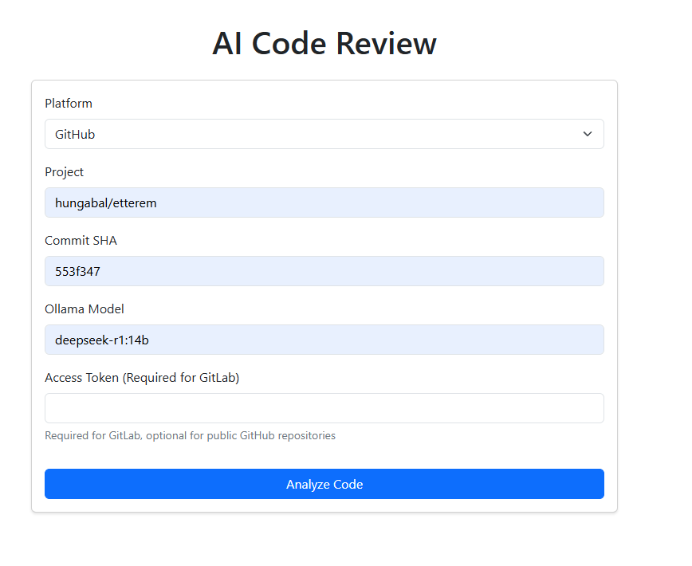
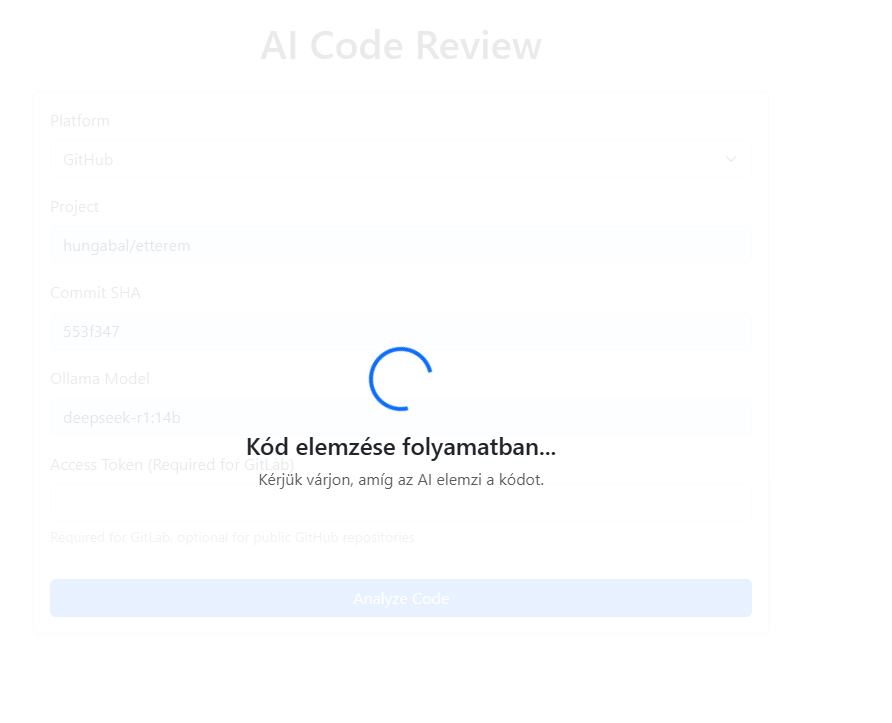
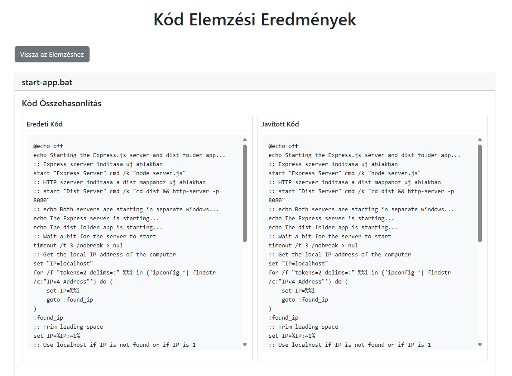
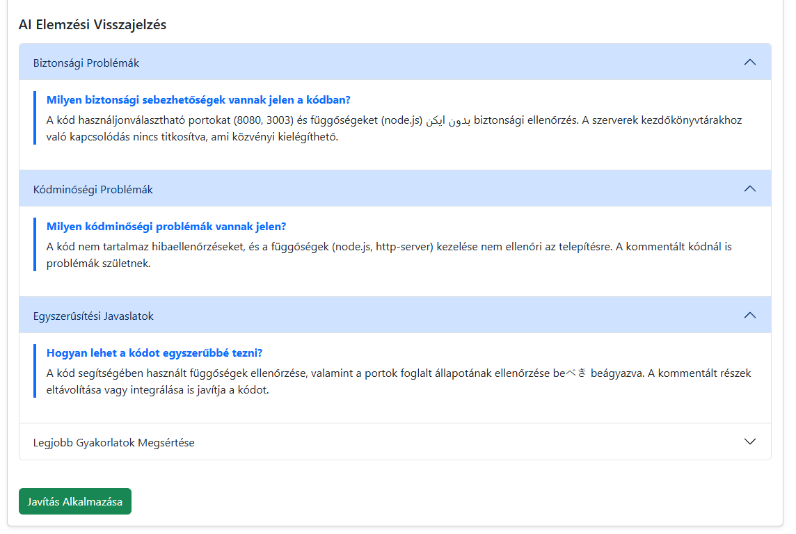

# AI Kódelemző

Webalkalmazás, amely az Ollama generate API-ját használja GitHub és GitLab commitok kódjának elemzésére. Az alkalmazás részletes kódelemzést nyújt, beleértve a biztonsági sebezhetőségeket, kódminőségi problémákat és javaslatokat a fejlesztésre.

## Képernyőképek a projektről






## Funkciók

- GitHub és GitLab tárolók támogatása
- Kódelemzés az Ollama generate API használatával
- Részletes elemzés, amely tartalmaz:
  - Biztonsági sebezhetőségeket
  - Kódminőségi problémákat
  - Egyszerűsítési javaslatokat
  - Legjobb gyakorlatok megsértését
- Párhuzamos kódösszehasonlítás
- Javasolt javítások alkalmazásának lehetősége
- Modern és reszponzív felhasználói felület

## Előfeltételek

- Node.js (v14 vagy újabb)
- Telepített és helyileg futó Ollama
- GitLab hozzáférési token (GitLab tárolókhoz)
- GitHub hozzáférési token (opcionális, privát tárolókhoz)

## Telepítés

1. Klónozd a tárolót:
```bash
git clone <repository-url>
cd aireview
```

2. Telepítsd a függőségeket:
```bash
npm install
```

3. Hozz létre egy `.env` fájlt a gyökérkönyvtárban:
```env
PORT=3000
```

4. Indítsd el az alkalmazást:
```bash
npm start
```

Fejlesztéshez automatikus újratöltéssel:
```bash
npm run dev
```

## Használat

1. Nyisd meg a böngésződet és navigálj a `http://localhost:3000` címre
2. Válaszd ki a platformot (GitHub vagy GitLab)
3. Add meg a projekt adatait:
   - GitHub esetén: tulajdonos/tároló formátumban
   - GitLab esetén: projekt útvonalát
4. Add meg a commit SHA-t, amelyet elemezni szeretnél
5. Válaszd ki a használni kívánt Ollama modellt
6. Add meg a hozzáférési tokent, ha szükséges
7. Kattints a "Kód elemzése" gombra az elemzés elindításához
8. Tekintsd át az eredményeket és alkalmazd a javasolt javításokat, ha szeretnéd

## Ollama Modellek

Az alkalmazás bármely Ollama modellel működik, amely képes megérteni és elemezni a kódot. Ajánlott modellek:
- codellama
- mistral
- llama2

Győződj meg róla, hogy a kívánt modell már le van töltve az Ollama-ban, mielőtt használnád.

## Közreműködés

Szívesen fogadjuk a közreműködéseket! Nyugodtan küldj be egy Pull Request-et.

## Licenc

Ez a projekt az MIT Licenc alatt áll - részletekért lásd a LICENSE fájlt. 